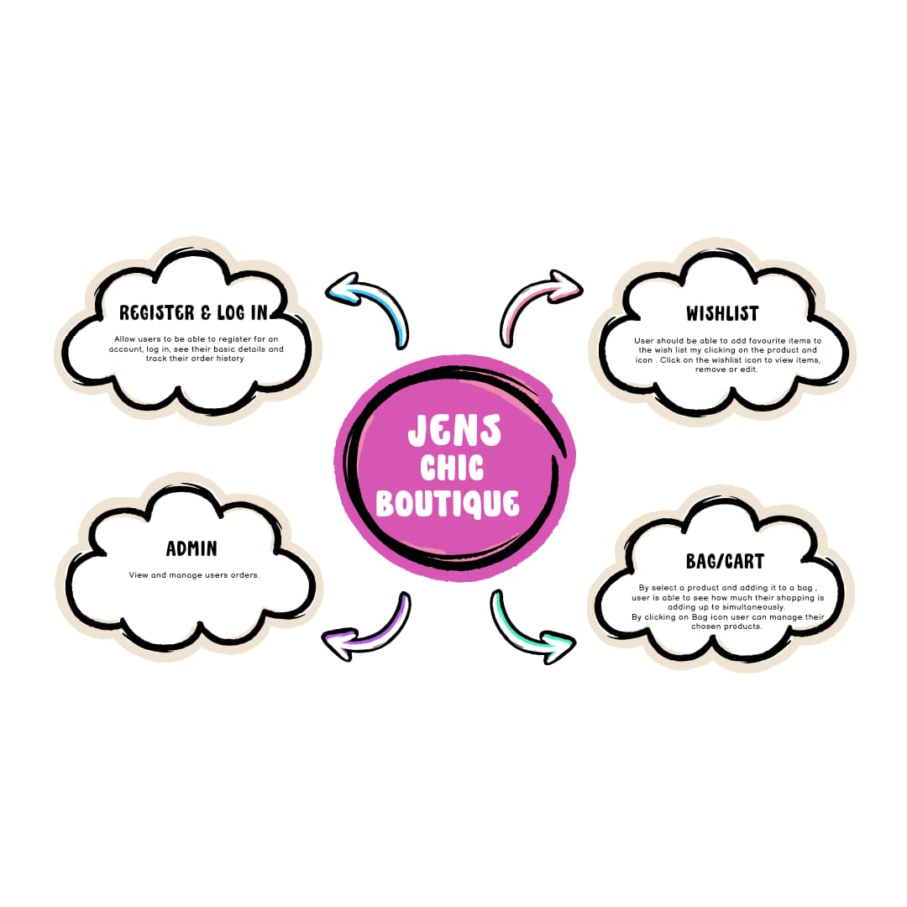
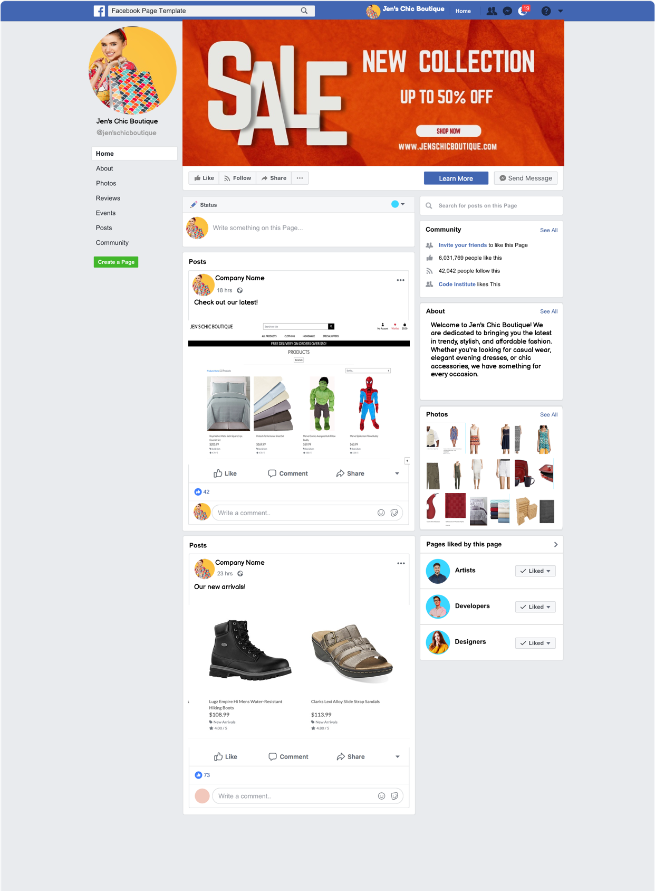

# Jen's Chic Boutique Web Development Project

Welcome to the Jen's Chic Boutique web development project repository! This project is designed to provide an e-commerce platform for managing products, purchasing products and user accounts.


## Table of Contents
- [Introduction](#introduction)
- [Technologies Used](#technologies-used)
- [Project Structure](#project-structure)
- [Installation](#installation)
- [Usage](#usage)
- [Manual Testing](#manual-testing)
- [Deployment](#deployment)
- [User Stories](#user-stories)
- [Future Features](#future-features)
- [Bugs](#bugs)
- [Toast Features](#toast-features)
- [Stripe Testing](#stripe-testing)
- [Credits](#credits)
- [Observation](#observation)

## Introduction
Jen's Chic Boutique is a web development project designed to make managing boutique items and user accounts easy. It features a user-friendly interface for customers. 

## Technologies Used
The project is built using the following technologies:

- Django
- Django AllAuth
- HTML/CSS/JavaScript 
- Git/GitHub
- Heroku
- ElephantSQL
- Stripe

## Project Structure
- **Root Directory**: Contains the main Django project files, `README.md`, and additional helper files (HTML, CSS, JS, IMG).
- **requirements.txt**: Python dependencies list.
- **Django Project**:
  - **jenschicboutique**: Contains the Django project settings and configurations.
- **Django Apps**:
  - **bag**: Handles the boutique items and orders.
  - **wishlist**: Manages user accounts and authentication.
  - **checkout**: Contains checkout content
- **Static files**:
  - **static**: Holds CSS, JavaScript, and other static files.
- **Templates**:
  - **templates**: Contains HTML template files.
- **404 Page Implemented**



## Installation
To set up the project locally, follow these steps:

1. Clone the repository:
   ```bash
   git clone https://github.com/missdays/JensChicBoutique
   cd jen-chic-boutique
   ```
2. Install Django and add the package to the `requirements.txt` file:
   ```bash
   pip3 install 'django<4’
   pip3 freeze --local > requirements.txt
   ```
3. Create a new Django project and app:
   ```bash
   django-admin startproject jenschicboutique .
   python3 manage.py startapp bag
   python3 manage.py startapp wishlist 
   python3 manage.py startapp checkout
   ```
4. Add the apps to the `INSTALLED_APPS` in `settings.py`.
5. After adding models, run migrations:
   ```bash
   python3 manage.py migrate
   ```
6. Run the development server:
   ```bash
   python3 manage.py runserver
   ```

These steps should prepare your environment. 

## Usage
On the website, users can perform the following actions:

- **Browse Items**: Users can browse product items, search items, choose item’s size, manage bag by adding and removing, 
- **Wishlist**: Users can add items to their wishlist. 
- **Review**: Users can leave a review. 
- **Order Management**: Users can add items to their bag and manage their shopping bag.
- **Checkout**: Users can checkout and add payment. 


## Manual Testing
I have tested this website myself to make sure everything works well and it's easy to use by doing the following:

- **Clicked around different pages and features a few times to make sure everything works smoothly.**
- **Tried making payment a few times.**
- **Made sure I could browse items and manage my bag.**
- **Looked at the website on both my computer and phone to make sure it looks good and works right on both.**
- **Checked code for any major bugs.**
- **Tested out all the important features to make sure it all flows smoothly for users.**
- **Kept track of any bugs or issues I ran into while testing and made sure to fix them up.**

## Deployment to Heroku
To deploy your project to Heroku, follow these steps:

1. **Create an account and verify it**:
   - Sign up for a Heroku account and verify your email address.
2. **Create a new app**:
   - Navigate to your Heroku dashboard and create a new app with a unique name.
3. **Update your code for deployment**:
   - Install `gunicorn` and add it to `requirements.txt`:
     ```bash
     pip3 install gunicorn~=20.1
     pip3 freeze --local > requirements.txt
     ```
4. **Enable GitHub integration**:
   - In your app's dashboard, go to the Deploy tab.
   - In the Deployment method section, enable GitHub integration by clicking on "Connect to GitHub".
5. **Select your repository**:
   - Start typing your project repository name into the search box and click Search.
   - Click on the GitHub repository you want to deploy from.
6. **Initiate deployment**:
   - Add the config var DATABASE_URL, and for the value, copy in your database url from ElephantSQL.
   - Scroll to the bottom of the page and click "Deploy Branch" to start a manual deployment of the main branch.
7. **View your deployed project**:
   - Once the deployment process is complete, click on "Open app" to view your deployed project.

![Deploy to Heroku]

## User Stories
### User
- I can browse available items.
- I can filter items by name/desc/asc/ price range.
- I can add items to my bag.
- I can remove items from my bag.
- I can update items in my bag. 
- I can see the price updating simultaneously when I edit items in the bag.
- I can add items to wishlist 
- I can leave a review of an item 


### Administrator
- I can manage product items.
- I can view and manage customer orders.
- I can view and manage customer payments


### Marketing

- **Offers**: Create and manage offers.
- **Social Media Integration**: Share products and offers on Facebook.
- **Email Marketing**: Send newsletters and offer emails to customers.
- **SEO Optimization**: Improve the website's visibility on search engines.
- **Analytics**: Track and analyse website traffic and user behaviour to improve marketing strategies.

## Future Features
- **Order Tracking**: Provide order tracking capabilities.
- **Promotion codes**: Add functionality for promotional codes 
- **Wishlist**: Verify if items are already added to Wishlist.
- **Review** Check if the user has already purchased that item before leaving a review.
- **Registration**: Users can register for an account.
- **Logout**: Users can log out of their accounts.
- **Order history**: Allow users to view their order history. 

## Bugs
- Users cannot view their order history.
- Users cannot manage their profile.
- Registration not working for users 
- Logout not working for users 
- CSS and static images not working

### Difficulties Encountered
- Encountered issues with Jquery. Managed to resolve them by following updated documentation. 

## Toast Features
To improve user friendliness, I added toast notifications for various actions:

- **Add to Cart**: Displays a toast notification when an item is added to the cart.
- **Remove from Cart**: Displays a toast notification when an item is removed from the cart.
- **Add to Wishlist**: Displays a toast notification when an item is added to the wishlist.
- **Remove from Wishlist**: Displays a toast notification when an item is removed from the wishlist.

## Stripe Testing
For the tester team, you can use the card Stripe provides for testing purposes. More information can be found in Stripe's documentation [here](https://docs.stripe.com/payments/accept-a-payment?platform=web).

## Credits
- Source of  image: Product images by Kaggle.com
- Source of icons: Fontawesome
- Based on the Code Institute Boutique Ado walkthrough 

## Observation 
- To show the css and static images to my project, I would need an Amazon account to connect to AWS services, as demonstrated in the walkthrough. However,I wasn't able to proceed with that step. Therefore the project hasn't got any css or images. If the project is ran on Debug mode, css and static images are shown.